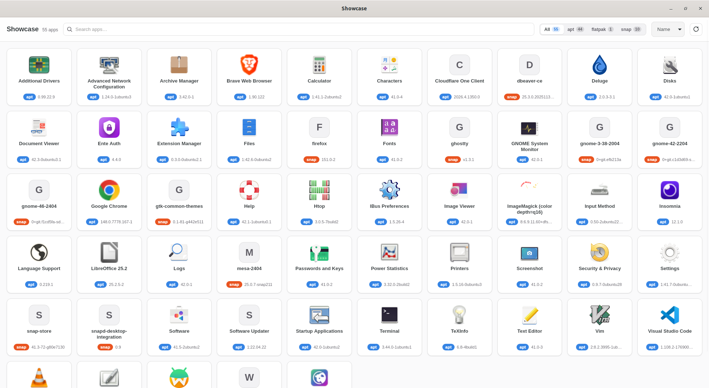
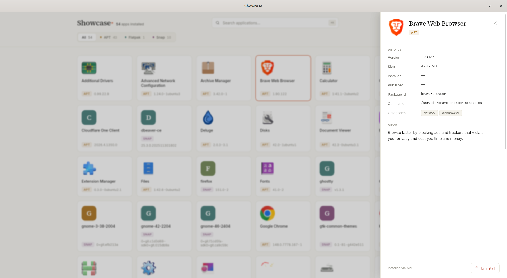

<div align="center">


# Showcase

**See and manage every app installed on your Linux system — `apt`, Flatpak, and Snap — in one clean, native desktop app.**






</div>

## What is Showcase?

Showcase is a desktop application for Ubuntu (and other Linux desktops) that gives you a single, visual place to **browse every installed graphical application** across all the ways software gets installed — system packages (`apt`/`dpkg`), **Flatpak**, and **Snap** — inspect each app's details, and **uninstall** the ones you no longer want, with a proper graphical password prompt.

No more remembering whether you installed something with `apt`, `flatpak`, or `snap`. Showcase finds them all, shows them together, and lets you remove them safely.

## Features

- 🗂️ **Unified view** — every GUI app from `apt`, Flatpak, and Snap in one grid, each tagged by source.
- 🔎 **Search, filter, and sort** — live search, filter by source (with live counts), sort by name, size, or recently installed.
- 📋 **Rich detail panel** — icon, version, install size, install date, publisher, categories, package id, launch command, and a full description.
- 🗑️ **Complete uninstall** — remove an app with one click, authenticated through the system polkit dialog, with the disk space it frees shown up front.
- 🛡️ **Safe by design** — refuses to remove essential system packages and base snaps; warns when removing an `apt` package may also remove things that depend on it.
- 🎨 **Native & themed** — clean light/dark interface that follows your system, with crisp app icons.
- ⚡ **Fast & resilient** — sources are queried in parallel; if one (e.g. `snapd`) is unavailable, the rest still load.

## Requirements

- **Ubuntu 22.04 LTS** or newer (or a derivative). GNOME is recommended; the polkit prompt needs a working authentication agent (standard on GNOME/KDE).
- `apt`/`dpkg` (always present). `flatpak` and `snapd` are optional — Showcase simply shows whichever are installed.

## Download & install

Prebuilt packages for **Ubuntu 22.04+ (amd64)** are published with every release.

### A) Direct download (recommended for most)

1. Go to the [**Releases** page](https://github.com/rabiulislam-xyz/showcase/releases) and open the latest release.
2. Download the `.deb` and the `SHA256SUMS` file into the same directory.
3. Verify the download, then install:

   ```bash
   sha256sum -c SHA256SUMS --ignore-missing
   sudo apt install ./Showcase_*_amd64.deb
   ```

> **Use `apt install ./…`, not `sudo dpkg -i …`.** `apt` pulls the runtime
> dependencies (`libwebkit2gtk-4.1-0`, `libgtk-3-0`); plain `dpkg -i` does not and
> fails with a "dependency problems" error. If you already ran `dpkg -i` and hit
> that, finish the install with:
> ```bash
> sudo apt-get install -f
> ```

Prefer a portable, no-install binary? Grab the **AppImage** from the same release and run it directly:

```bash
chmod +x Showcase_*.AppImage
./Showcase_*.AppImage
```

### B) APT repository (auto-updates)

Add the signed Showcase APT repository once, then receive updates through `apt` like any other package:

```bash
sudo mkdir -p /etc/apt/keyrings
sudo wget -O /etc/apt/keyrings/showcase-archive-keyring.gpg https://rabiulislam-xyz.github.io/showcase/showcase-archive-keyring.gpg
echo "deb [signed-by=/etc/apt/keyrings/showcase-archive-keyring.gpg] https://rabiulislam-xyz.github.io/showcase stable main" | sudo tee /etc/apt/sources.list.d/showcase.list
sudo apt update && sudo apt install showcase
```

> This path is available only after the maintainer has completed the one-time
> setup in [docs/DISTRIBUTING.md](docs/DISTRIBUTING.md). If `apt update` can't
> reach the repository, use the direct download above instead.

> **For maintainers:** see [docs/DISTRIBUTING.md](docs/DISTRIBUTING.md) for how
> releases are built and how to enable the signed APT repository.

## Install & run from source

### 1. Toolchains

- **Rust** (stable) — install via [rustup](https://rustup.rs).
- **Node.js** 18+ and npm.

### 2. System build dependencies (one-time)

Tauri needs a few GTK/WebKit development libraries:

```bash
./scripts/setup-deps.sh
```

This runs `sudo apt-get install` for `libwebkit2gtk-4.1-dev`, `libgtk-3-dev`, `libayatana-appindicator3-dev`, `librsvg2-dev`, and `pkg-config`.

### 3. Run in development

```bash
npm install
npm run tauri dev
```

The first build compiles the Rust backend and can take a couple of minutes.

### 4. Build a release package

```bash
npm run tauri build
```

This produces a `.deb` and an AppImage under `src-tauri/target/release/bundle/`. Install the `.deb` with:

```bash
sudo apt install ./src-tauri/target/release/bundle/deb/showcase_*_amd64.deb
```

Then launch **Showcase** from your applications menu.

## Usage

1. Launch Showcase — it lists every installed GUI app.
2. **Search** by name, **filter** by source (All / APT / Flatpak / Snap), or **sort** by name, size, or recency.
3. Click an app to open its **detail panel** with full metadata and description.
4. Click **Uninstall** → confirm → authenticate in the system password dialog. The app disappears from the grid when removal succeeds.

> **About permissions:** Showcase itself runs unprivileged. Removal is escalated **per action** through polkit. `apt` and Snap removals run via `pkexec` (so the system password dialog appears); Flatpak uses its own native uninstall (no password needed for per-user installs).

## How it works

- **Discovery** — `.desktop` entries are the source of truth for "what is an app" (exactly what appears in your applications menu). Each entry is classified by location into a source.
- **Enrichment** — each source adds its metadata: `apt` via `dpkg-query` (version, size, essential flag), Flatpak via `flatpak list`, Snap via the local `snapd` REST socket (version, size, install date).
- **One app per package** — multiple launchers from the same package collapse to a single entry (uninstalling removes the package, not one shortcut).
- **Backend** — a small Rust core exposes Tauri commands: `list_apps`, `get_app_details`, `uninstall_app`. Sources sit behind a command-runner seam, so all parsing/merging logic is unit-tested with fixtures and never touches the live system in tests.
- **Frontend** — SvelteKit (Svelte 5) with a typed API layer, pure filter/sort logic, and presentational components. Icons render through Tauri's asset protocol.

## Project structure

```
showcase/
├── src/                     # SvelteKit frontend (Svelte 5 + TypeScript)
│   ├── lib/
│   │   ├── components/      # AppCard, AppGrid, Header, AppDetail, ConfirmDialog, Toast …
│   │   ├── types.ts api.ts filter.ts stores.ts format.ts theme.css
│   └── routes/              # +page.svelte (the app), +layout.svelte
├── src-tauri/               # Rust backend (crate: showcase_lib)
│   └── src/                 # model, desktop, runner, dpkg, snapd, icons,
│                            #   sources/{apt,flatpak,snap}, aggregate, commands, uninstall
├── scripts/setup-deps.sh    # one-time system build deps
└── docs/superpowers/        # design specs + phased implementation plans
```

## Development

```bash
cargo test --manifest-path src-tauri/Cargo.toml                    # Rust unit + gated integration tests
cargo clippy --manifest-path src-tauri/Cargo.toml --all-targets    # lint (clean)
npm test                                                           # frontend (Vitest)
npm run check                                                      # svelte-check / TypeScript
```

The project was built in three reviewed phases — **(1)** backend enumeration core, **(2)** browse UI, **(3)** uninstall — each documented under `docs/superpowers/specs/` and `docs/superpowers/plans/`.

## Security

- The app never runs as root; only the specific uninstall operation escalates, per action, via polkit.
- Package identifiers are passed as argument arrays, never interpolated into a shell (injection-safe).
- Guards block removal of `Essential` apt packages and base/core snaps before any privileged call.

## Roadmap

- Installing apps (not just uninstalling)
- AppImage detection
- Per-app permission management (Flatpak/Snap interfaces)
- Live, line-by-line uninstall progress
- Published release binaries

## Tech stack

[Tauri v2](https://tauri.app) · Rust · [SvelteKit](https://svelte.dev) (Svelte 5) · TypeScript · WebKitGTK · PackageKit/polkit

## License

[MIT](LICENSE) © 2026 Rabiul Islam
